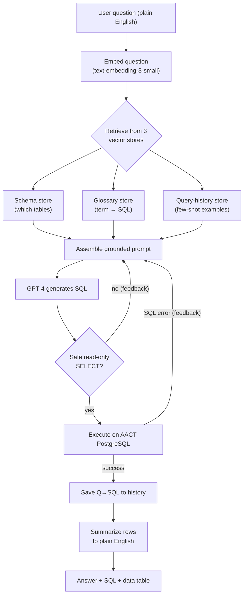

# 🔬 TrialSpeak AI

**Ask 500,000+ clinical trials anything — in plain English. No SQL required.**

[](https://trialspeak-ai-mbxy8xxtakg4wc9v29ozfd.streamlit.app)


> A production-style **Retrieval-Augmented Generation (RAG)** system that lets non-technical users query the live [AACT](https://aact.ctti-clinicaltrials.org/) clinical-trials database (a PostgreSQL mirror of ClinicalTrials.gov) by simply asking.
>
> *"How many Phase 3 cancer trials are currently recruiting?"* → **1,011**

---

## The problem

Naive "LLM-to-SQL" looks great in a demo but collapses in production. It reaches **~90%
execution accuracy on academic benchmarks** (Spider 1.0) but drops to **10–20% on real
enterprise databases** (Spider 2.0). Three reasons:

1. **Vocabulary mismatch** — a user says *"active trial"*, but the column stores `'RECRUITING'`.
2. **Implicit business rules** — *"cancer trial"* requires joining the `conditions` table and
   matching many disease terms; this knowledge lives in analysts' heads, not the schema.
3. **Schema scale** — you can't fit 51 tables and hundreds of columns into a prompt.

## The solution: three-vector-store RAG

Instead of dumping the schema into a prompt, the system **retrieves only the relevant context**
per question from three independent vector stores, then grounds the LLM in those facts.

| Store | Answers | Updated |
|-------|---------|---------|
| **Schema** | *Which tables/columns are relevant?* | Rarely (schema changes) |
| **Glossary** | *What do the user's words mean in SQL?* | Occasionally (new terms) |
| **Query history** | *What query worked for a similar question?* | Constantly (every success) |

## Architecture



Two things make it robust:
- **Self-correction loop** — if a query errors, the exact database error is fed back to the
  model, which fixes its own SQL and retries (bounded to 3 attempts).
- **Defense-in-depth safety** — a programmatic `SELECT`-only validator *plus* AACT's own
  read-only access.

## Features

- 🗣️ Natural-language → SQL over a live 500K+ trial database
- 🧠 Three-vector-store RAG (schema + glossary + learned examples)
- 🔁 Self-correcting: repairs its own failed queries
- 📈 Self-improving: learns from every successful query (few-shot)
- 🛡️ Read-only safety validation (defense in depth)
- 💬 Streamlit chat UI with an auditable "view SQL & data" panel

## Tech stack

| Layer | Tool |
|-------|------|
| Source DB | AACT PostgreSQL (live ClinicalTrials.gov mirror) |
| DB driver | psycopg2 |
| Embeddings | OpenAI `text-embedding-3-small` (1536-dim) |
| Generation | OpenAI GPT-4 |
| Vector DB | Supabase (pgvector, HNSW, cosine) |
| Frontend | Streamlit |

## Project structure

```
clinical_nl2sql/
├── app.py                       # Streamlit web UI
├── check_credentials.py         # preflight: validates all 3 services
├── config/
│   └── supabase_setup.sql        # vector-store DDL (3 tables + 3 RPC functions)
├── crawler/
│   ├── phase1a_connect.py        # reusable AACT connection (context manager)
│   ├── explore_schema.py         # interactive schema exploration
│   ├── phase1b_schema_crawler.py # schema → output/schema_raw.json
│   └── check_glossary_values.py  # reconcile glossary literals vs real data
├── embeddings/
│   ├── phase1c_embed_schema.py   # embed schema  → schema_chunks
│   ├── phase1d_glossary.py       # embed glossary → glossary_chunks
│   └── test_retrieval.py         # Phase 1 retrieval validation gate
├── nl2sql/
│   ├── retrieval.py              # shared retrieval (3 stores) + save_query
│   ├── generate_sql.py           # prompt assembly + GPT-4 SQL generation
│   ├── execute.py                # safety validator + AACT executor
│   ├── answer.py                 # table formatter + LLM summary
│   ├── pipeline.py               # answer_question() + respond() facade
│   └── seed_history.py           # bootstrap query-history examples
└── output/
    └── schema_raw.json           # generated schema chunks
```

## Setup

**Prerequisites:** Python 3.10+, and free accounts for
[AACT](https://aact.ctti-clinicaltrials.org/users/sign_up),
[OpenAI](https://platform.openai.com/), and [Supabase](https://supabase.com/).

```bash
# 1. Install
python -m venv venv
source venv/bin/activate          # Windows: venv\Scripts\Activate.ps1
pip install -r requirements.txt

# 2. Configure credentials
cp .env.example .env              # then fill in your keys

# 3. Verify all three services are reachable
python check_credentials.py
```

Then run `config/supabase_setup.sql` once in the **Supabase SQL Editor** to create the
vector stores.

```bash
# 4. Build the knowledge base
python crawler/phase1b_schema_crawler.py   # crawl schema → JSON
python embeddings/phase1c_embed_schema.py  # embed schema store
python crawler/check_glossary_values.py    # see real DB values...
python embeddings/phase1d_glossary.py      # ...then embed glossary store
python embeddings/test_retrieval.py        # validate retrieval
python nl2sql/seed_history.py              # seed few-shot examples
```

## Usage

```bash
# Command line
python nl2sql/pipeline.py

# Web app
streamlit run app.py
```

## Key design decisions

- **Three separate stores, not one** — different retrieval roles and update lifecycles, so each
  is independently tunable.
- **Embed the match-side, return the payload-side** — embed questions/terms (what we match
  against), return SQL hints/examples (what we need).
- **Ground every literal in observed data** — a real-world data drift (status values changed
  to uppercase enums) is exactly why we never trust assumed literals.
- **LLM phrases, SQL provides facts** — the summary is grounded only in returned rows, so it
  can't hallucinate numbers.
- **A clean `respond()` facade** — the whole pipeline behind one call, so the UI is trivial.

## Limitations & future work

- **Quality gate on learning** — currently saves every successful query; "executes" ≠
  "semantically correct". Next: dedup + human/result-based quality gate.
- **Hybrid retrieval** — add keyword search alongside vectors for exact literal terms.
- **Quantitative eval** — a recall@k suite to track retrieval quality over time.
- **EXPLAIN-based pre-validation** — catch errors before a full execution.

## License

MIT
